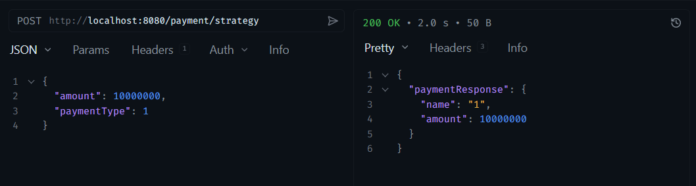
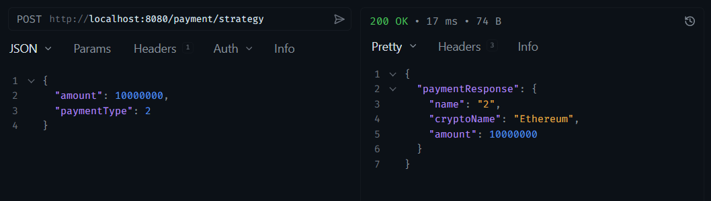

# 💳 Spring Boot Strategy Pattern Demo

### Project Summary:

- This project demonstrates the use of **Strategy Design Pattern** for managing different payment methods (Crypto, Card). It is designed to process various payment types through a single endpoint and manage the specific logic for each payment method in an isolated manner using the Strategy Pattern. The system adheres to the Open/Closed Principle, allowing new payment methods to be easily added.

<br>

---

### Tech Stack:

[](https://www.java.com/en/)
[](https://spring.io/)
[](https://projectlombok.org/)
[](https://gradle.org/)
[](https://springdoc.org/)
[](https://docs.docker.com/)
[](https://docs.docker.com/compose/)

<br>

---

### 🚀 Setup

#### Application Configuration

```yaml
server:
  port: 8080
```

<br>

#### Start Application

```bash
docker-compose up -d
```

<br>

---

### 📚 API Documentation

#### 💰 Payment Operations

<details>
<summary>💳 Crypto Payment </summary>



</details>

<details>
<summary>💵 Card Payment </summary>



</details>

<br>

#### Request Example

```bash
POST /payment/strategy
Content-Type: application/json

{
  "type": "CRYPTO",
  "cryptoName": "Ethereum",
  "amount": 10000000
}
```

<br>

#### Response Example

```json
{
  "paymentResponse": {
    "name": "2",
    "cryptoName": "Ethereum",
    "amount": 10000000
  }
}
```

<br>

---

### 📄 License

This project is licensed under the MIT License. See the [LICENSE](LICENSE) file for details

**Created by** [Mehmet Furkan KAYA](https://www.linkedin.com/in/mehmet-furkan-kaya/)